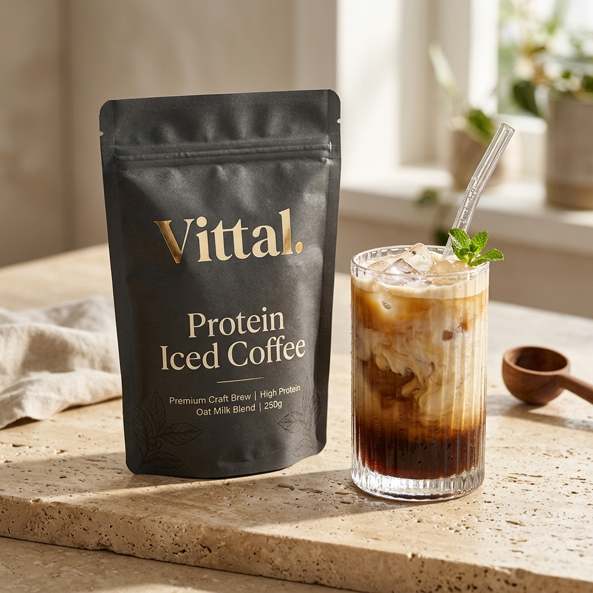

# Vittal — Premium Shopify Online Store 2.0 Theme

<div align="center">
  
  <br><br>
  <h3>Clean Fuel. Real Coffee. <i>Zero Compromise.</i></h3>
  <p>A luxury, high-conversion <b>Shopify Online Store 2.0 Theme</b> engineered for <b>Vittal</b> — 100% single-origin Colombian cold brew crafted with 20g clean plant protein isolate.</p>
</div>

---

## 📸 Visual Showcase & Included Product Imagery

| Product | Flavor / Format | Price | Asset |
| :--- | :--- | :--- | :--- |
| **Vittal Protein Iced Coffee** | 100% Colombian Supremo | $39.00 *(was $49.00)* | [`assets/vittal-pouch.jpg`](./assets/vittal-pouch.jpg) |
| **Vittal Mocha Protein Cold Brew** | Dark Cocoa & Electrolytes | $39.00 *(was $49.00)* | [`assets/vittal-mocha.jpg`](./assets/vittal-mocha.jpg) |
| **Vittal Vanilla Bean Cold Brew** | Madagascar Vanilla & Fiber | $39.00 *(was $49.00)* | [`assets/vittal-vanilla.jpg`](./assets/vittal-vanilla.jpg) |
| **Vittal Master Trio Bundle** | 3-Pouch Value Lineup | $89.00 *(Save $28)* | [`assets/vittal-bundle.jpg`](./assets/vittal-bundle.jpg) |
| **Vittal RTD Chilled Cold Brew** | 12 Cans (12 fl oz) | $42.00 *(was $52.00)* | [`assets/vittal-can.jpg`](./assets/vittal-can.jpg) |
| **Vittal Colombian Decaf Protein** | Swiss Water Decaf | $39.00 *(was $49.00)* | [`assets/vittal-decaf.jpg`](./assets/vittal-decaf.jpg) |
| **Vittal Barista Shaker Tumbler** | 24 oz Insulated Stainless Steel | $24.00 *(was $30.00)* | [`assets/vittal-shaker.jpg`](./assets/vittal-shaker.jpg) |
| **Salted Caramel Macchiato** | Pink Himalayan Sea Salt | $42.00 *(was $49.00)* | [`assets/vittal-caramel.jpg`](./assets/vittal-caramel.jpg) |

<br>

<div align="center">
  
  <p><i>Direct Fair-Trade Colombian Coffee Harvest at 1,800m Altitude &bull; Huila Region</i></p>
</div>

---

## ☕ Theme Architecture & Directory Layout

This repository adheres strictly to the official [Shopify Online Store 2.0](https://shopify.dev/docs/themes) architecture:

```
├── assets/
│   ├── base.css                      # Master styling, typography, variables, responsive layout
│   ├── theme.js                      # Slide-out Ajax cart drawer, variant & subscription logic
│   ├── vittal-pouch.jpg              # Studio photography: Hero Pouch + Iced Glass
│   ├── vittal-mocha.jpg              # Studio photo: Mocha Protein Cold Brew with cacao
│   ├── vittal-vanilla.jpg            # Studio photo: Vanilla Bean Cold Brew with pods
│   ├── vittal-bundle.jpg             # E-commerce bundle shot: Master Trio 3-Pouch lineup
│   ├── vittal-can.jpg                # Commercial shot: RTD Chilled Cold Brew Cans 12-Pack
│   ├── vittal-decaf.jpg              # Commercial shot: Colombian Decaf Protein Cold Brew
│   ├── vittal-shaker.jpg             # Studio photo: Barista Shaker Tumbler in charcoal
│   ├── vittal-caramel.jpg            # Studio photo: Salted Caramel Macchiato with sea salt
│   ├── vittal-farmer.jpg             # Documentary photo: Colombian farmer holding coffee cherries
│   ├── vittal-pour.jpg               # Macro lifestyle photo: Oat milk pouring into iced cold brew
│   └── vittal-nutrition.jpg          # Clean studio shot: Official Nutrition facts back label
├── config/
│   ├── settings_schema.json          # Theme customizer settings (colors, typography, cart, socials)
│   └── settings_data.json            # Default theme presets
├── layout/
│   └── theme.liquid                  # Master Liquid layout wrapper
├── locales/
│   └── en.default.json               # English translations & localization dictionary
├── sections/
│   ├── announcement-bar.liquid
│   ├── header.liquid
│   ├── hero-banner.liquid
│   ├── marquee.liquid
│   ├── features-grid.liquid
│   ├── featured-product.liquid
│   ├── comparison-table.liquid
│   ├── story-section.liquid
│   ├── testimonials.liquid
│   ├── faq-accordion.liquid
│   ├── cta-banner.liquid
│   ├── main-product.liquid
│   ├── product-nutrition-specs.liquid
│   ├── product-recommendations.liquid
│   ├── main-collection.liquid
│   ├── collection-quiz-banner.liquid
│   ├── trust-badges.liquid
│   ├── cart-drawer.liquid
│   ├── main-cart.liquid
│   ├── main-page.liquid
│   └── main-404.liquid
├── snippets/
│   ├── product-card.liquid
│   ├── price.liquid
│   ├── rating-stars.liquid
│   ├── icon-cart.liquid
│   ├── icon-search.liquid
│   ├── icon-user.liquid
│   ├── icon-star.liquid
│   ├── icon-check.liquid
│   ├── icon-arrow.liquid
│   └── icon-close.liquid
├── templates/
│   ├── index.json                    # Homepage OS 2.0 section layout
│   ├── product.json                  # PDP OS 2.0 section layout
│   ├── collection.json               # Catalog OS 2.0 section layout
│   ├── cart.json                     # Dedicated cart layout
│   ├── page.json                     # Standard page layout
│   └── 404.json                      # Error page layout
├── preview.html                      # Standalone local interactive preview
└── README.md
```

---

## 🛍️ How to Install on Shopify

### Method 1: Connect via GitHub (Automatic Sync — Recommended)
1. Open your **Shopify Admin** &rarr; **Online Store** &rarr; **Themes**.
2. Click **Add theme** &rarr; **Connect from GitHub**.
3. Select this repository `store-2-` and the `main` branch.
4. Any future commits pushed here will automatically sync to your live Shopify store!

### Method 2: Direct ZIP Upload in Shopify Admin
1. Download the pre-built `vittal-shopify-theme.zip`.
2. In **Shopify Admin** &rarr; **Online Store** &rarr; **Themes**, click **Add theme** &rarr; **Upload zip file**.
3. Upload and click **Publish** or **Customize**.

---

## ✨ Features & Functional Components

- **Slide-out Ajax Cart Drawer**: Live `$45.00` Free Express Shipping calculation progress bar, instant quantity controls, and direct checkout link.
- **Subscription vs. One-Time Switcher**: Dynamic price calculations ($39.00 vs $49.00) updating checkout payloads in real-time.
- **Nutritional Comparison Matrix**: Vittal Cold Brew vs Traditional Coffeehouse Frappe vs Typical RTD Shakes.
- **Harvest Integrity Section**: Colombian single-origin beans grown at 1,800m altitude.
- **Category Filter Pills**: Filter instantly by Cold Brew, RTD Cans, Bundles, Gear, and Seasonal Roasts.
- **60-Second Ritual Quiz**: Interactive consultation banner for personalized bean recommendations.
- **Interactive FAQ Accordion**: Smooth animated expand/collapse.
- **Fully Responsive**: Optimized for Mobile (375px), Tablet (768px), and Desktop (1440px+).
